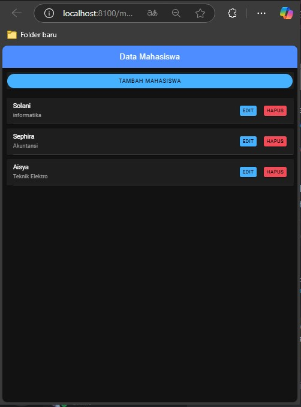
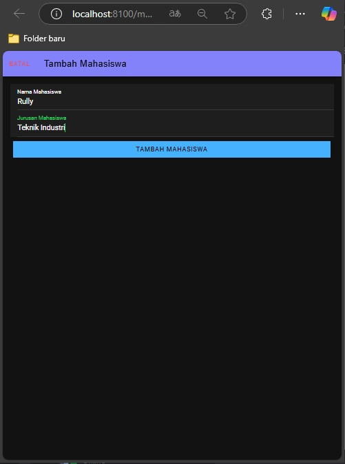
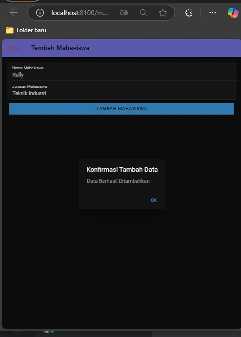
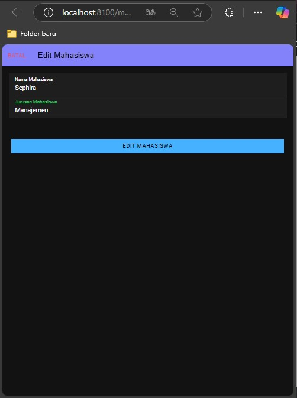
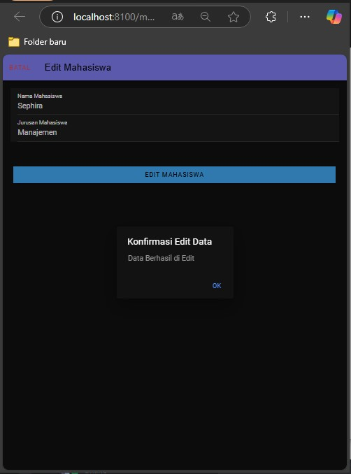
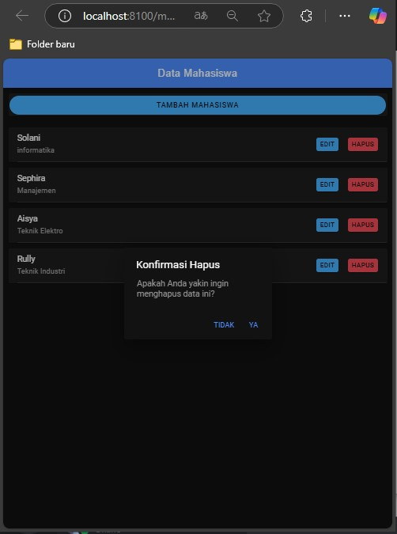

# PrakMobile_Pert9
Praktikum Pemrograman Mobile Pert 9 Tugas 8
Solani (H1D022033)

Kode ini adalah sebuah aplikasi Angular/Ionic yang menampilkan, menambah, mengedit, dan menghapus data mahasiswa dengan menggunakan beberapa modal dan layanan API untuk CRUD. Berikut adalah cara kerja dari kode ini:

### 1. **Menampilkan Data Mahasiswa (`getMahasiswa` Method)**

   - Pada saat halaman pertama kali dimuat, method `ngOnInit` memanggil `getMahasiswa`, yang mengakses endpoint `tampil.php` melalui `ApiService` untuk mendapatkan daftar mahasiswa dari server.
   - Data yang berhasil didapat akan disimpan dalam `dataMahasiswa` dan ditampilkan dalam daftar pada halaman utama.

### 2. **Menambahkan Mahasiswa (`tambahMahasiswa` Method)**

   - Tombol "Tambah Mahasiswa" memicu fungsi `openModalTambah`, yang mengaktifkan `modalTambah` (modal untuk menambah data mahasiswa) dan mereset input form.
   - Setelah itu, modal akan menampilkan input untuk memasukkan `nama` dan `jurusan` mahasiswa yang baru.

   - Saat tombol "Tambah Mahasiswa" di dalam modal ditekan, method `confirmTambahMahasiswa` akan menampilkan konfirmasi menggunakan `AlertController`.
   - Jika pengguna menekan “OK” pada konfirmasi, method `tambahMahasiswa` akan dipanggil.
   - Method ini memanggil `ApiService` dengan endpoint `tambah.php` untuk menambah data mahasiswa ke server, kemudian akan memuat ulang daftar data mahasiswa dengan memanggil `getMahasiswa` untuk menampilkan data terbaru.

### 3. **Mengedit Data Mahasiswa (`editMahasiswa` Method)**

   - Tombol "Edit" di setiap item mahasiswa akan memicu `openModalEdit`, membuka modal edit dan memuat data mahasiswa yang dipilih melalui fungsi `ambilMahasiswa`.

   - Dalam modal, pengguna bisa mengubah `nama` dan `jurusan`. Setelah selesai, tombol “Edit Mahasiswa” akan memanggil `confirmEditMahasiswa` untuk menampilkan konfirmasi perubahan.
   - Setelah konfirmasi, `editMahasiswa` akan memanggil endpoint `edit.php` untuk menyimpan perubahan ke server. Data mahasiswa kemudian diperbarui pada halaman utama.

### 4. **Menghapus Mahasiswa (`hapusMahasiswa` Method)**

   - Tombol "Hapus" di setiap item mahasiswa akan memicu `confirmHapusMahasiswa`, yang menampilkan konfirmasi penghapusan.
   - Jika pengguna memilih "Ya", method `hapusMahasiswa` akan dipanggil dan mengakses endpoint `hapus.php` untuk menghapus data mahasiswa dari server. Setelah itu, daftar mahasiswa diperbarui dengan memanggil `getMahasiswa`.

### 5. **`ApiService` untuk Integrasi API**
   - `ApiService` mengelola semua permintaan HTTP untuk berkomunikasi dengan server. 
     - `tampil` untuk mengambil semua data.
     - `tambah` untuk menambahkan data baru.
     - `edit` untuk mengedit data.
     - `hapus` untuk menghapus data.
     - `lihat` untuk mengambil data spesifik berdasarkan `id`.
   - Semua permintaan HTTP menggunakan endpoint spesifik yang diberikan sebagai argumen, seperti `tambah.php`, `edit.php`, dll.

### 7. **Reset Form pada Modal (`resetModal` Method)**
   - Method `resetModal` digunakan untuk membersihkan input `nama` dan `jurusan` setiap kali modal tambah atau edit dibuka atau ditutup, sehingga data yang sebelumnya tidak tersimpan.

